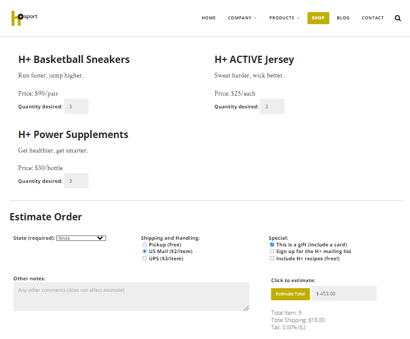

# Shopping Cart Page with JavaScript

This is a shopping cart page implemented using HTML, CSS, and JavaScript.

## preview



## Description

The Shopping Cart Page is a web application that allows users to select items, specify quantities, choose a shipping state, and calculate the total cost including shipping. The page uses JavaScript to perform real-time calculations and provide an estimated cost to the user.

## Features

- Item selection: Users can choose from a range of items and specify quantities.
- Shipping state selection: Users can select their shipping state to calculate shipping costs and applicable taxes.
- Real-time calculation: The total cost, including shipping and taxes, is calculated and displayed to the user dynamically as they make selections.
- Error handling: Appropriate error messages are displayed when required fields are not filled or invalid input is provided.

## Installation

1. Clone the repository:

   ```shell
   git clone https://github.com/sadeq-yaqobi/shoppingCartPage-addingJS.git

2. Open the index.html file in your web browser.

## Usage

1. Open the shopping cart page in your web browser.
2. Select the items you want to purchase and specify the quantities.
3. Choose your shipping state from the dropdown menu.
4. The total cost, including shipping and taxes, will be calculated and displayed in real-time.

## Contributing

Contributions are welcome! If you find any issues or have suggestions for improvements, please feel free to create an issue or submit a pull request.

## License

This project is licensed under the [MIT License](https://opensource.org/licenses/MIT)..

## Credits
This project was developed by [sadeq yaqobi](https://github.com/sadeq-yaqobi).